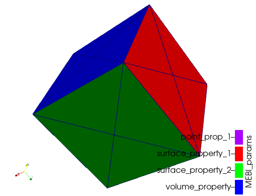

# MshReader.jl
A minimal msh mesh format file reader.

## Scope

The goal and scope of this package is to provide a function to read .msh files generated with (http://gmsh.info).

## Developer's guide

Clone the repo
```
$ git clone git@github.com:jorgepz/MshReader.jl.git
```

Enter to the folder and open julia with
```
$ cd MshReader.jl
$ julia --project=.
```

Run the cube example
```julia
julia> include(joinpath("examples","readCubeMesh.jl"))
```

this generates a .vtu file which can be viewed using paraview


