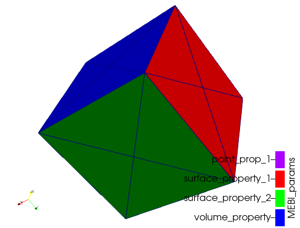

# MshReader.jl
A minimal msh mesh format file reader.

[](https://jorgepz.github.io/MshReader.jl/stable/)
[](https://jorgepz.github.io/MshReader.jl/dev/)
[](https://github.com/jorgepz/MshReader.jl/actions/workflows/CI.yml?query=branch%3Amain)
[](https://codecov.io/gh/jorgepz/MshReader.jl)


## Scope

The goal and scope of this package is to provide a function to read .msh files generated with (http://gmsh.info).

## Developer's guide

Clone the repo
```
$ git clone git@github.com:jorgepz/MshReader.jl.git
```

Enter to the folder and open julia with
```
$ cd MshReader.jl
$ julia --project=.
```

Run the cube example
```julia
julia> include(joinpath("examples","readCubeMesh.jl"))
```

This example script generates a .vtu file (using https://jipolanco.github.io/WriteVTK.jl/ ) which can be viewed using paraview


